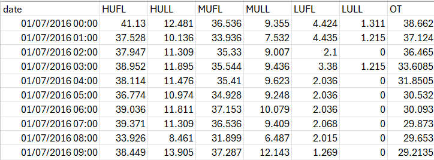

# Neural Network Project
# TSMixer

The implementation is done based on .yml files, respectively `coeficients.yml`, `best.coeficients.yml` and `gridsearch.coeficiets.yml` where are specified all the parameters to train the models. 


## Data

Datasets are in this [link](https://github.com/zhouhaoyi/ETDataset/tree/11ab373cf9c9f5be7698e219a5a170e1b1c8a930).

## Dataset Used

From the dataset above I chosed ETTh1 to train the model.




[Feature Explanation]
* `date`: The recorded date
* `HUFL`: High UseFul Load
* `HULL`: High UseLess Load
* `MUFL`: Middle UseFul Load
* `MULL`: Middle UseLess Load
* `LUFL`: Low UseFul Load
* `LULL`: Low UseLess Load
* `OT`: Oil Temperature (target)


Each parameter is initialization is on .yml files, that can be chosen during training. 

## Running
After downloading the datasets create a new folder named `dataset` and upload there the dataset you want to analyse.

```bash
cd dataset
```
Open a virtual environment to avoid conflicts with dependencies with other projects:

```bash
python -m venv venv
source venv/Scripts/activate
```

Install the requirements:

```bash
pip install -r requirements.txt
```
## I have given the opportunity to run the code in the `project.ipynb` file or to run it on the terminal by executing the following commands.
#### Furthermore the results like predictions and loss function can be run even without training because I will upload the train result in output.etdataset.
### Train the model:

```bash
python main.py --conf  coeficients.yml --command train
```
Instead you can change coeficients.yml with best.coeficients.yml for better accuracy but more time to train. Or in the files can be made other initialization for the hyperparamethers.
The output will be in the `output.etdataset` directory specified in the config file.

#### Predict some of the validation data and plot it:

```bash
python main.py --conf coeficients.yml --command predict --show
```
#### Plot the loss curves:

```bash
python main.py --conf coeficients.yml --command loss --show
```


#### Run a grid search over the hyperparameters:

```bash
python main.py --conf gridsearch.coeficients.yml --command grid-search
```
